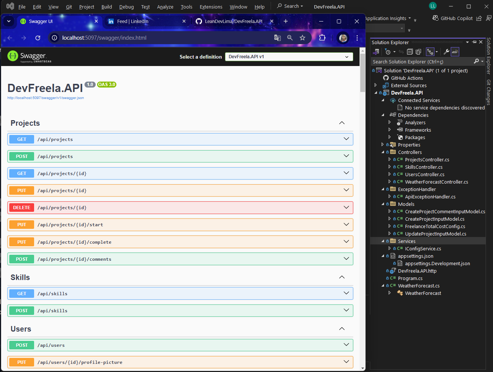

# DevFreela

## Click on ► to choose your language

<details>
  <summary>English EN 🇺🇸
  </summary>


Welcome to **DevFreela**, a powerful and intuitive API designed to manage projects between clients and freelancers! This project was created to facilitate the connection between those who need services and those who can offer quality solutions.

---

##  About the Project

**DevFreela** is an API built with **ASP.NET Core** that allows:
- **Clients** create and manage projects.
- **Freelancers** apply for projects and track their progress.
- Efficient management of tasks, deadlines and deliveries.

This project was developed to review and apply fundamental API concepts, such as controllers, actions, endpoints, dependency injection, exception management and much more.

---

##  Technologies Used

- **Language**: C#
- **Framework**: ASP.NET Core
- **Main Features**:
  - Controllers and Actions to manage projects and users.
  - RESTful endpoints for CRUD operations.
  - Dependency injection to improve modularity and testability.
  - Exception management to ensure a user-friendly error experience.
  - File input configuration for uploading documents and images.

---

## How to Execute the Project

Follow the steps below to run **DevFreela** locally:

### Prerequisites

- [.NET SDK](https://dotnet.microsoft.com/download) installed (version 6.0 or higher).
- A code editor like [Visual Studio](https://visualstudio.microsoft.com/) or [VS Code](https://code.visualstudio.com/).

### Steps
1. Clone the repository:
   ```bash
   git clone https://github.com/LeanDevLima/DevFreela.git
   ```
2. Navigate to the project folder:
   ```bash
   cd DevFreela
   ```
3. Restore dependencies:
   ```bash
    dotnet restore
   ```
4. Run the project:
   ```bash
    dotnet run
   ```
5. Access the API in the browser or via tools like Postman or Insomnia:
    ```bash
    http://localhost:5000/api/projects
   ```

### Project Structure

- **Controllers**: Responsible for managing API requests and responses.
- **Models**: Represent system entities, such as projects, users and skills.
- **Services**: Business logic and application rules.
- **Middlewares**: Exception management and other global features.
- **Settings**: Dependency injection and file input settings.

### Main Features

- **Project Registration**: Clients can create new projects with title, description, deadline and budget.
- **Freelancer Application**: Freelancers can apply for available projects.
- **File Upload**: Attach documents and images to projects.
- **Exception Management**: Customized error handling to improve the user experience.
- **RESTful Endpoints**: CRUD operations for projects, users and skills.


---

## Contribution

Contributions are welcome! If you want to improve **DevFreela**, follow the steps below:
1. Fork the project.
2. Create a branch for your feature (`git checkout -b feature/nova-feature`).
3. Commit your changes (`git commit -m 'Adding new feature'`).
4. Push to the branch (`git push origin feature/nova-feature`).
5. Open a Pull Request.

---

## 👨‍💻 Authors

- **Leanderson** - Developer and API enthusiast. [Linkedin](https://www.linkedin.com/in/leanderson-dias-de-lima/?locale=en_US)

---

Made with ❤️ by **Leanderson**.

</details>


<details>
  <summary>Portugues PT-BR 🇧🇷 
  </summary>

Bem-vindo ao **DevFreela**, uma API poderosa e intuitiva desenvolvida para gerenciar projetos entre clientes e freelancers! Este projeto foi criado para facilitar a conexão entre quem precisa de serviços e quem pode oferecer soluções de qualidade.

---

##  Sobre o Projeto

O **DevFreela** é uma API construída com **ASP.NET Core** que permite:
- **Clientes** criarem e gerenciarem projetos.
- **Freelancers** se candidatarem a projetos e acompanharem seu progresso.
- Gerenciamento eficiente de tarefas, prazos e entregas.

Este projeto foi desenvolvido para revisar e aplicar conceitos fundamentais de APIs, como controllers, actions, endpoints, injeção de dependência, gerenciamento de exceções e muito mais.

---

##  Tecnologias Utilizadas

- **Linguagem**: C#
- **Framework**: ASP.NET Core
- **Principais Funcionalidades**:
  - Controllers e Actions para gerenciar projetos e usuários.
  - Endpoints RESTful para operações CRUD.
  - Injeção de dependência para melhorar a modularidade e testabilidade.
  - Gerenciamento de exceções para garantir uma experiência de erro amigável.
  - Configuração de entrada de arquivos para upload de documentos e imagens.

---

## Como Executar o Projeto

Siga os passos abaixo para rodar o **DevFreela** localmente:

### Pré-requisitos
- [.NET SDK](https://dotnet.microsoft.com/download) instalado (versão 6.0 ou superior).
- Um editor de código como [Visual Studio](https://visualstudio.microsoft.com/) ou [VS Code](https://code.visualstudio.com/).

### Passos
1. Clone o repositório:
   ```bash
   git clone https://github.com/LeanDevLima/DevFreela.git
   ```
2. Navegue até a pasta do projeto:
   ```bash
   cd DevFreela
   ```
3. Restaure as dependências:
   ```bash
    dotnet restore
   ```
4. Execute o projeto:
   ```bash
    dotnet run
   ```
5. Acesse a API no navegador ou via ferramentas como Postman ou Insomnia:
    ```bash
    http://localhost:5000/api/projects
   ```
### Estrutura do Projeto

- **Controllers**: Responsáveis por gerenciar as requisições e respostas da API.
- **Models**: Representam as entidades do sistema, como projetos, usuários e habilidades.
- **Services**: Lógica de negócio e regras de aplicação.
- **Middlewares**: Gerenciamento de exceções e outras funcionalidades globais.
- **Configurações**: Injeção de dependência e configurações de entrada de arquivos.

### Funcionalidades Principais

- **Cadastro de Projetos**: Clientes podem criar novos projetos com título, descrição, prazo e orçamento.
- **Candidatura de Freelancers**: Freelancers podem se candidatar a projetos disponíveis.
- **Upload de Arquivos**: Anexar documentos e imagens aos projetos.
- **Gerenciamento de Exceções**: Tratamento de erros personalizado para melhorar a experiência do usuário.
- **Endpoints RESTful**: Operações CRUD para projetos, usuários e habilidades.


---

## 🤝 Contribuição

Contribuições são bem-vindas! Se você quiser melhorar o **DevFreela**, siga os passos abaixo:
1. Faça um fork do projeto.
2. Crie uma branch para sua feature (`git checkout -b feature/nova-feature`).
3. Commit suas mudanças (`git commit -m 'Adicionando nova feature'`).
4. Push para a branch (`git push origin feature/nova-feature`).
5. Abra um Pull Request.

---

## 👨‍💻 Autores

- **Leanderson** - Desenvolvedor e entusiasta de APIs. [Linkedin](https://www.linkedin.com/in/leanderson-dias-de-lima/)

---

Feito com ❤️ por **Leanderson**.

</details>


## IMAGE



## CERTIFICATE


   